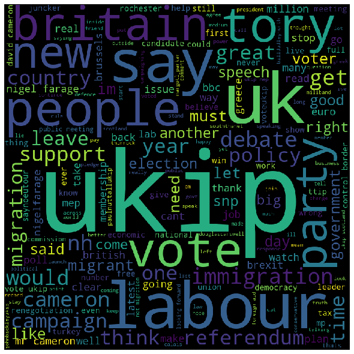
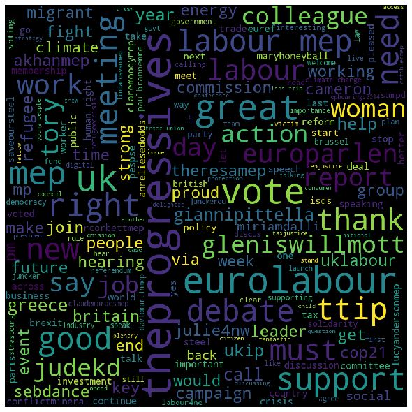

# European Parliament Twitter activites MEP 1.0

We will investigate a dataset of tweets made by Members of the European Parliament. We will use data collected by Darko Cherepnalkoski, Andreas Karpf, Igor Mozetič, and Miha Grčar for their paper [Cohesion and Coalition Formation in the European Parliament: Roll-Call Votes and Twitter Activities](https://journals.plos.org/plosone/article?id=10.1371/journal.pone.0166586)

This assignment is based on an original assignment by Ioannis Pavlopoulos (postdoc researcher) and Vasiliki Kougia (PhD candidate at AUEB).

---

> Ioannis (Ion) Petropoulos, 8160107 <br />
> Department of Management Science and Technology <br />
> Athens University of Economics and Business <br />
> ionpetro@gmail.com

## Read the notebook [here](https://nbviewer.jupyter.org/github/ionpetro/Clustering-and-Classification-of-MEPs-Tweets/blob/master/src/European%20Parliament%20Twitter%20activities%20MEP%201.0.ipynb)

## WordCloud

We drew wordclouds for **EFDD** and **S&D**

### EFDD:



Is the Europe of Freedom and Direct Democracy strongly connected with the UKIP? Of course it is, since EFDD has been chaired by Nigel Farage who also happens to be the leader of UK Independence party (UKIP)

### S&D:



* These are the socialists & the Democrats.
* They are fighting for social justice, equality and sustainability. 
* The words we see on the cloud maybe refer to the **S&Ds outlook Brexit:** work with Labour for a closer EU-UK relationship or put the question back to the people

## Results - Clustering

Top terms per cluster:

> Cluster 0: ukip labour nhs party people just immigration policy great debate <br />
> Cluster 1: trade ttip free union need deal deals great jude_kd intergroup<br />
> Cluster 2: ttip isds vote debate labour public eurolabour good malmstromeu eppgroup<br />
> Cluster 3: migration policy ukip net crisis asylum need eppgroup cameron mass<br />
> Cluster 4: greece tsipras greek euro eppgroup eurozone people yes imf new<br />
> Cluster 5: eppgroup great people good new meeting need support debate just<br />
> Cluster 6: vote ukip labour yes people report majority debate just leave<br />
> Cluster 7: uk ukip labour brexit migrants govt good steel leave people<br />

* Cluster 7 is reffering to brexit (or the political situation in UK)
* Cluster 2 is probably talking about international issues (ttip - isds)
* Cluster 3 is talking about a migration crisis in the UK
* Cluster 6 is reffering to the UK Independance Party
* Cluster 4 is addressing the political situation in Greece

## Results - Classification

Using SGDClassifier we managed to predict the political group using tweet's text, achieving **60% accuracy** with Cross Validation.

We used ```CountVectorizer``` as a vectorizer and ```TfidfTransformer``` as a transformer.

## Libraries

#### Tweet Extraction:

* tweepy

#### Data Manipulation:

* pandas
* numpy
* re

#### Visualization:

* yellowbrick
* matplotlib
* wordcloud

#### Machine Learning:

* sklearn
* xgboost